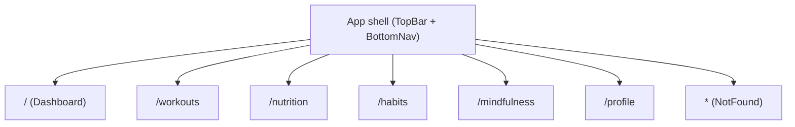

# Healthify Frontend (React)

## Overview
Healthify is a mobile-first wellness tracker that helps users manage workouts, nutrition, habits, and mindfulness. This package contains the React web frontend built with Create React App (CRA) and React 18. The UI applies the “Ocean Professional” theme (deep blue primary, amber accents) with subtle retro touches such as scanline overlays and a retro-styled badge. The layout is designed for phones first, featuring a sticky top bar and a bottom navigation for primary routes.

The app is intentionally resilient when a backend is not configured. Data services gracefully return empty lists, allowing development and testing to proceed offline.

## Project Structure
The codebase follows a simple, feature-oriented structure.

```text
healthify_frontend/
  src/
    components/
      common/         # Reusable UI primitives (Button, Card, RetroBadge)
      layout/         # App layout pieces (TopBar, BottomNav)
    context/          # Global state and theming (ThemeContext, AppStateContext)
    pages/            # Routed screens (Dashboard, Workouts, Nutrition, Habits, Mindfulness, Profile, NotFound)
    services/         # API client and feature services (workouts, nutrition, habits, mindfulness)
    styles/           # Global and theme styles (Ocean Professional and retro accents)
    theme/            # Token definitions used by components
    utils/            # Shared helpers (env configuration, logging)
    __tests__/        # App-level smoke tests
```

- components/common provides design-aligned primitives that encapsulate styling and accessibility concerns.
- components/layout provides the top bar (route-aware title, brand, skip link) and a bottom navigation optimized for touch.
- context contains two providers:
  - ThemeContext for light/dark theme toggling persisted to localStorage and reflected on html[data-theme].
  - AppStateContext for in-memory state slices (user, workouts, nutrition, habits, mindfulness, flags) via a reducer and typed action creators.
- services contains a small JSON API client plus feature-specific service modules. When no API base is configured, each module returns safe defaults (e.g., empty arrays).
- utils/env centralizes normalization of REACT_APP_* variables and exposes typed getters (getApiBase, getBackendUrl, getWsUrl, etc.). utils/log gates console output by log level.

## Getting Started
To run the app locally:

1. Install dependencies:
   - npm install

2. Start the development server:
   - npm start

3. Open the app in your browser:
   - The preview runs on http://localhost:3000 by default.

4. Build for production:
   - npm run build

5. Run tests:
   - npm test

## Environment Configuration
The app reads configuration from REACT_APP_* variables. All access is centralized in src/utils/env.js, which provides normalized getters and safe defaults. When no backend or API base is configured, services return empty data so the UI remains usable offline.

### Supported variables and usage
| Variable | Purpose | Default | Consumed by |
| --- | --- | --- | --- |
| REACT_APP_FRONTEND_URL | Public URL of the frontend. Normalized and exposed for introspection. | http://localhost:3000 | env.getFrontendUrl()/getConfig() |
| REACT_APP_BACKEND_URL | Base URL of the backend service. Used preferentially by healthcheck and to derive API/WS defaults. | (empty) | env.getBackendUrl(), apiClient.healthcheck() |
| REACT_APP_API_BASE | Root for REST API requests. If not set and BACKEND_URL is set, defaults to BACKEND_URL + "/api". If neither is set, services return safe defaults. | Derived or (empty) | env.getApiBase(), services/* |
| REACT_APP_WS_URL | Base for WebSocket connections. If not set and BACKEND_URL is set, defaults to BACKEND_URL with ws(s) + "/ws". | Derived or (empty) | env.getWsUrl(), getConfig() |
| REACT_APP_HEALTHCHECK_PATH | Path appended to the chosen base for health checks. | /healthz | env.getHealthcheckPath(), apiClient.healthcheck() |
| REACT_APP_LOG_LEVEL | Logger verbosity: silent, error, warn, info, debug. | dev: debug; test: error; prod: warn | utils/log.js |
| REACT_APP_FEATURE_FLAGS | Feature flag object or CSV string. See details below. | (empty) | env.getFeatureFlags(), feature-flagged UI (Profile debug) |
| REACT_APP_EXPERIMENTS_ENABLED | Global fallback boolean for experiments if no per-key experiment flag is found. | false | env.isExperimentEnabled() |
| REACT_APP_NODE_ENV | Overrides NODE_ENV-derived behavior in env.js (e.g., log-level defaults). | NODE_ENV or development | env.getNodeEnv() |
| REACT_APP_NEXT_TELEMETRY_DISABLED | Boolean to disable telemetry by default. | true | env.isTelemetryDisabled() |
| REACT_APP_ENABLE_SOURCE_MAPS | Boolean to control source map emission. | true in non-production | env.isSourceMapsEnabled() |
| REACT_APP_PORT | Numeric port exposed via config (for introspection); CRA dev server still binds to 3000 by default. | 3000 | env.getPort(), getConfig() |
| REACT_APP_TRUST_PROXY | Boolean surface to record proxy trust (introspection only in the SPA). | false | env.getTrustProxy(), getConfig() |

### Example .env
You can set environment variables in a .env file at the project root (Create React App reads REACT_APP_* at build/start time).

```bash
# URLs
REACT_APP_FRONTEND_URL=http://localhost:3000
REACT_APP_BACKEND_URL=
REACT_APP_API_BASE=
REACT_APP_WS_URL=
REACT_APP_HEALTHCHECK_PATH=/healthz

# Runtime behavior
REACT_APP_LOG_LEVEL=debug
REACT_APP_NEXT_TELEMETRY_DISABLED=true
REACT_APP_ENABLE_SOURCE_MAPS=true

# Port and proxy (introspection only in SPA)
REACT_APP_PORT=3000
REACT_APP_TRUST_PROXY=false

# Feature flags
REACT_APP_FEATURE_FLAGS={"debug":{"profileFooter":true}}
REACT_APP_EXPERIMENTS_ENABLED=false
```

### How configuration is consumed
- Services read env.getApiBase(); if it is not set (and no derived fallback exists), the list functions return empty arrays and create/update/remove functions return local objects so the app remains usable offline.
- apiClient.healthcheck() prefers env.getBackendUrl() and falls back to env.getApiBase(), using env.getHealthcheckPath() to form the URL. It never throws and surfaces a normalized result.
- utils/log.js gates console output using REACT_APP_LOG_LEVEL with sensible defaults by env.getNodeEnv().

## Feature Flags
Feature flags are parsed from REACT_APP_FEATURE_FLAGS. The parser supports either a JSON object or a comma-separated string (CSV-style) such as "flagA=true,flagB=42,flagC".

- JSON example:
  - REACT_APP_FEATURE_FLAGS={"debug":{"profileFooter":true},"experiments":{"newDashboard":true}}
- CSV example:
  - REACT_APP_FEATURE_FLAGS=debugFooter=true,showDebug=true

The Profile page includes a feature-flagged debug panel that reveals resolved configuration and runs a backend healthcheck. It can be enabled with any of these flags:
- JSON path: {"debug":{"profileFooter": true}} or {"debug":{"showProfileFooter": true}}
- CSV aliases: debug_profile_footer=true or debugFooter=true or showDebug=true

Experiments can be toggled under an "experiments" object, e.g. {"experiments":{"newNavbar":true}}. The helper env.isExperimentEnabled(key) checks per-key flags and falls back to REACT_APP_EXPERIMENTS_ENABLED when a key is absent.

Note about retro accents: the subtle retro styling (e.g., scanline overlays and the RetroBadge) is part of the default theme and is not currently controlled by a feature flag.

## Routing and Pages
The application shell renders a sticky top bar, a routed main content area, and a bottom navigation. Routes are defined in src/App.js:

- / → Dashboard: displays quick stats, theme toggle, and a link that keeps CRA’s demo tests passing (“Learn React”).
- /workouts → Workouts: loads workouts via services/workoutsService.
- /nutrition → Nutrition: loads meals via services/nutritionService.
- /habits → Habits: loads habits via services/habitsService.
- /mindfulness → Mindfulness: loads sessions via services/mindfulnessService.
- /profile → Profile: shows user settings placeholder and an optional feature-flagged debug panel.
- * → NotFound: accessible 404 with a call-to-action to return home.



## Theming
The UI uses the “Ocean Professional” theme with blue as the primary and amber as the secondary/accent. Theme values are exposed as CSS variables in src/styles/theme.css and as JS tokens in src/theme/tokens.js. A ThemeProvider controls light/dark modes and synchronizes html[data-theme].

- Light/dark toggling is available via the ThemeContext:
```javascript
import { useTheme } from "./context/ThemeContext";

function ThemeToggle() {
  const { theme, toggleTheme } = useTheme();
  return (
    <button onClick={toggleTheme}>
      Switch to {theme === "light" ? "dark" : "light"} mode
    </button>
  );
}
```

- Retro accents use the .retro-scanline utility and the RetroBadge component to introduce subtle nostalgic styling without compromising readability.

## Testing
The project uses Jest and React Testing Library. Unit tests mock the feature services so no network is required and tests are deterministic.

- Run tests in watch mode:
  - npm test
- Run tests in CI:
  - CI=true npm test -- --watchAll=false

Example tests:
- src/__tests__/test_smoke.test.jsx validates initial rendering and navigation via the bottom nav.
- src/pages/__tests__/test_Dashboard.test.jsx validates core dashboard cards and empty-state rendering.

## Available Scripts
- npm start: Starts the development server (preview on http://localhost:3000).
- npm test: Runs the test runner in interactive watch mode.
- npm run build: Builds the app for production into the build/ folder.

